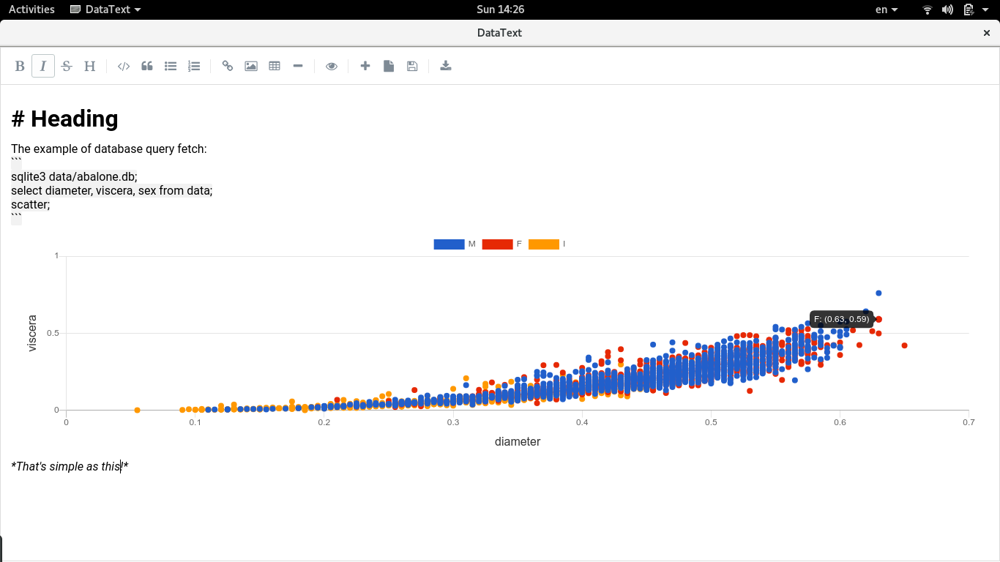

# DataText

***Under development! Not ready yet.***

 

## TO BE DONE
- [X] Fix of multiple rendering
- [X] CSV load with alasql
- [X] Previews
- [ ] Toolbar: New/Save/Load/Export (with images) 

## How to make a query and visualize it

Example with MySQL:
```
mysql localhost abalone_database root password;
select diameter, viscera, sex from data;
scatter;
```

Example with Sqlite:
```
sqlite data/abalone.db;
select diameter, viscera, shucked, sex from data;
scatter viscera, diameter, sex;
scatter diameter, shucked;
```

Example with CSV (using `alasql`) and you always have to set table as simply `csv`:
```
csv data/abalone.csv;
select sum(cast (diameter as float)) as diameter, sex from csv where shucked > 0.5 group by sex;
bars sex, diameter;
```

> CSV data must be comma-separated with header columns

0. Lines should be separated by `;`,
1. First line should be connection information (examples are self-explanatory), only csv, sqlite and mysql are supported for now,
2. Second line should be `select` query with at least two columns to fetch. Or three columns, if you need to group your data on chart (you can use more thant 2-3, if you want to show more than one diagram),
3. Third and further lines are visualization types: `scatter`, `lines` or `bars`. When you don't provide fields, it takes first column as X axis, second as Y axis, and third as grouping (if present). You may specify other order, for example `scatter column_2, column_1` or `lines column_3, column_2, column_1`, where `column_*` - is the name of the fetched fields.


## Project setup
```
npm install
```

### Compiles and hot-reloads for development
```
npm run electron:serve
```

### Compiles and minifies for production
```
npm run electron:build
```

